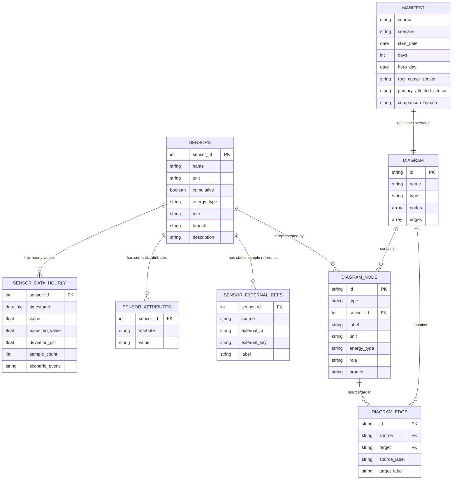
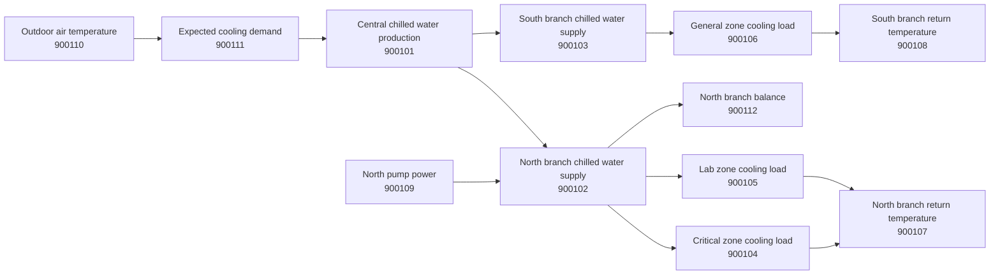

# EnergyOps Copilot Sample Dataset Structure

This folder contains an anonymized, synthetic time-series dataset for the
hackathon. It is intentionally small: one cooling scenario, 12 sensors, one
topology diagram, and hourly actual-vs-expected measurements.

## File Relationship Diagram

## Physical Topology Diagram

## Files

| File | Purpose | Main key |
| --- | --- | --- |
| `manifest.json` | Dataset-level metadata and scenario description. | none |
| `sensors.csv` | Sensor catalog with units, roles, branches, and descriptions. | `sensor_id` |
| `sensor_data_hourly.csv` | Hourly synthetic measurements and expected baseline values. | `sensor_id`, `timestamp` |
| `sensor_attributes.csv` | Long-form attributes for each sensor. | `sensor_id`, `attribute` |
| `sensor_external_refs.csv` | Stable fake external references for integrations. | `sensor_id` |
| `diagrams/cooling_trace.json` | Machine-readable topology graph. | `id` |
| `diagrams/cooling_trace_graph.txt` | Human-readable topology edge list. | none |

## Column Dictionary

### `sensors.csv`

| Column | Type | Meaning |
| --- | --- | --- |
| `sensor_id` | integer | Synthetic stable identifier. Joins to data, attributes, refs, and diagram nodes. |
| `name` | string | Human-readable anonymized sensor name. |
| `unit` | string | Measurement unit, for example `kWh`, `kW`, or `°C`. |
| `cumulative` | boolean | Always `False` in this sample; hourly rows are interval values. |
| `energy_type` | string/null | Energy domain such as `cold` or `electricity`; blank for reference temperatures. |
| `role` | string | Semantic role: `source`, `branch`, `consumer`, `return`, `support`, `reference`, or `balance`. |
| `branch` | string | Logical branch: `campus`, `north`, `south`, or `reference`. |
| `description` | string | Short explanation of what the sensor represents. |

### `sensor_data_hourly.csv`

| Column | Type | Meaning |
| --- | --- | --- |
| `sensor_id` | integer | Foreign key to `sensors.csv`. |
| `timestamp` | ISO datetime | UTC hour start. |
| `value` | float | Generated actual value for that hour. |
| `expected_value` | float | Baseline value without the injected anomaly. |
| `deviation_pct` | float | Percent difference between `value` and `expected_value`. |
| `sample_count` | integer | Synthetic count of raw samples represented by the hourly value. |
| `scenario_event` | string | Set to `north_branch_spike` for affected north-branch rows during the hero window. |

### `sensor_attributes.csv`

| Column | Type | Meaning |
| --- | --- | --- |
| `sensor_id` | integer | Foreign key to `sensors.csv`. |
| `attribute` | string | Attribute name. Current attributes are `role` and `branch`. |
| `value` | string | Attribute value. |

### `sensor_external_refs.csv`

| Column | Type | Meaning |
| --- | --- | --- |
| `sensor_id` | integer | Foreign key to `sensors.csv`. |
| `source` | string | Fake integration source, currently `hackathon-sample`. |
| `external_id` | string | Stable synthetic external ID. |
| `external_key` | string | Stable machine-readable key used by the generator and topology. |
| `label` | string | External display label. |

### `diagrams/cooling_trace.json`

| Field | Type | Meaning |
| --- | --- | --- |
| `id` | string | Diagram ID, currently `cooling_trace`. |
| `name` | string | Display name. |
| `type` | string | Diagram type, currently `energy_topology`. |
| `nodes[]` | array | Topology nodes. Each node maps to one `sensor_id`. |
| `nodes[].id` | string | Stable graph node key. Usually matches `sensor_external_refs.external_key`. |
| `nodes[].position` | object | X/Y coordinates for simple rendering. |
| `nodes[].data` | object | Label, sensor ID, unit, energy type, role, and branch. |
| `edges[]` | array | Directed topology links. |
| `edges[].source` | string | Source node ID. |
| `edges[].target` | string | Target node ID. |
| `edges[].data` | object | Human-readable source and target labels. |

## Scenario Notes

The hero event is `north_branch_spike` on `2026-06-24` from `05:00` to `08:00`
UTC. The critical zone load is the root-cause signal. The north branch and
central production rise in response, while the south branch remains near its
expected profile.

For most analysis tasks, start with:

1. Join `sensor_data_hourly.csv` to `sensors.csv` on `sensor_id`.
2. Filter `timestamp` around `2026-06-24T05:00:00Z` to `2026-06-24T08:00:00Z`.
3. Compare north branch sensors against the south branch comparison sensor.
4. Use `diagrams/cooling_trace.json` to trace upstream and downstream context.
